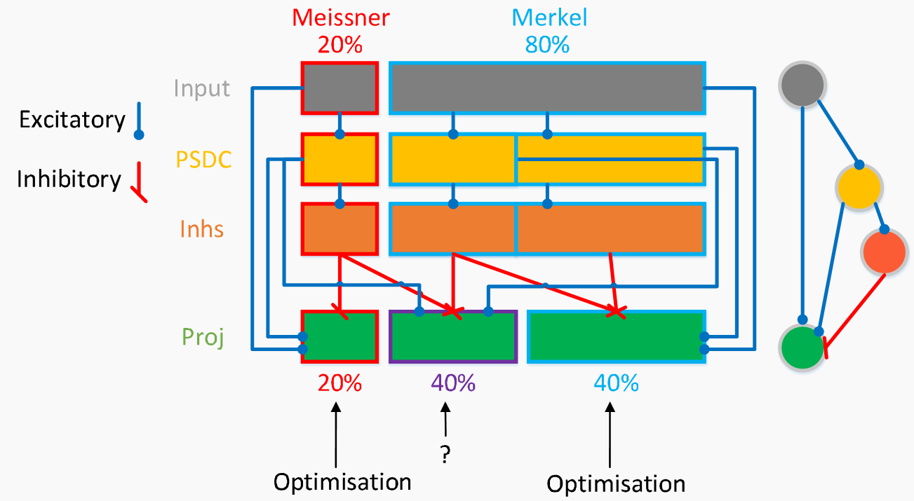
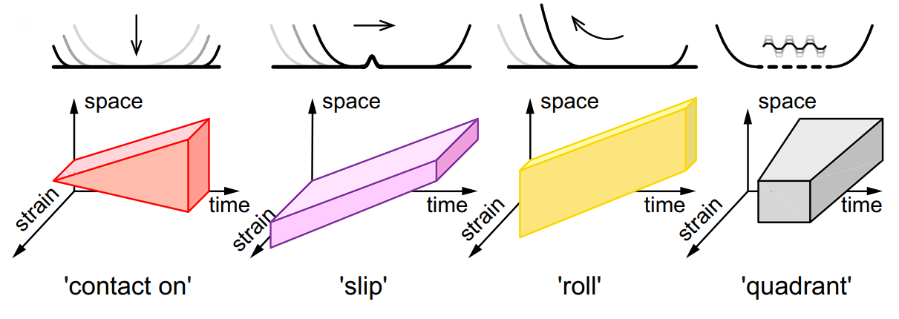
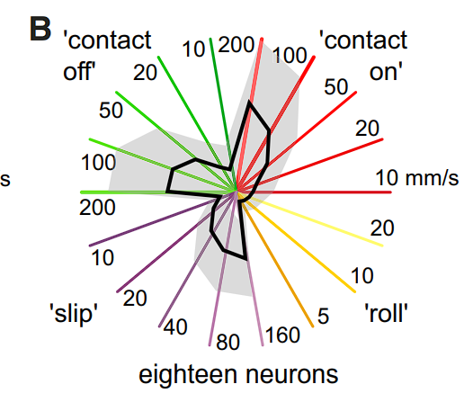
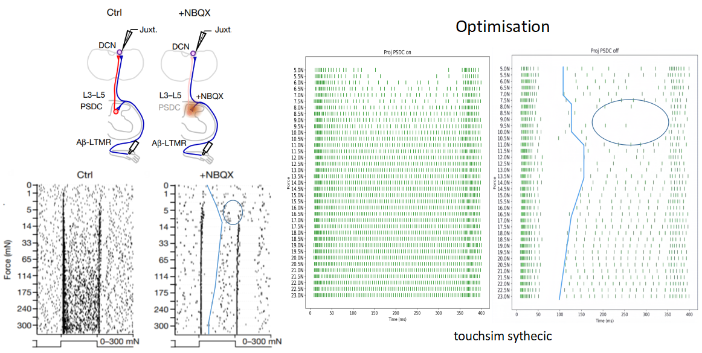
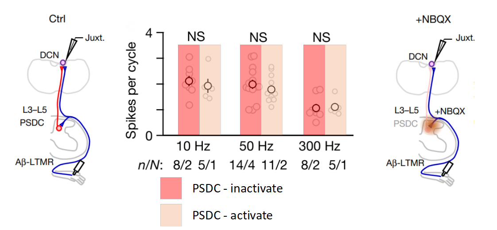

## Dorsal column + PSDC model + RA/SA split in the Cuneate Nucleus + Population segregation by tactile stimulus type

### Model scheme

  

### What is considered in the model
The model accounts for the specialization of the cuneate nucleus for specific types of mechanoreceptors, with separation into RA and SA subregions, as well as a shared population that integrates the outputs of both subnuclei.
Ref: *Emergence of a brainstem somatosensory tonotopic map for substrate vibration* - Kuo-Sheng Lee, Alastair J. Loutit, Dominica de Thomas Wagner, Mark Sanders & Daniel Huber, 2025.

There is also segregation of the somatosensory nucleus by the type of mechanical stimulus.

  

  

Ref: *Segregation of Tactile Input Features in Neurons of the Cuneate Nucleus* - Henrik Jörntell, Fredrik Bengtsson, Pontus Geborek, Anton Spanne, Alexander V. Terekhov, and Vincent Hayward, 2014.

This allows us to divide the overall system into two contextual models: one model of the nucleus that is better trained to process vibratory stimuli, and another model that is better suited for processing light-touch stimuli.
Although the referenced study primarily analyzes different subtypes of light touch, even within a single stimulus type clear neuronal clusters are observed. Therefore, between different stimulus types the corresponding populations may be even more strongly segregated. Indirect confirmation of this can also be found in the results `results\111100_hard_pattern_...`.

Another important novelty compared to other models is the inclusion of the Post-Synaptic Dorsal Column (PSDC) layer, which has a significant impact on the perception of sustained touch:

  

However, it has little to no effect on vibratory perception:

  

Ref: *The encoding of touch by somatotopically aligned dorsal column subdivisions* - Josef Turecek, Brendan P. Lehnert & David D. Ginty, 2022.

For this reason, the PSDC layer was removed from the final model trained for vibratory perception. Previously, in that configuration, the PSDC layer contributed only minor noise and did not play any functional role.

### Why did you switch from NEURON API to NetPyNE?

NetPyNE simply helps to reduce clutter in the code caused by the object-oriented aspects of the NEURON API, making the code more readable without losing functionality. The only limitation is that when writing mini-models, which serve as building blocks of the larger model, one still needs to learn NMODL — this is the only, but relatively minor, drawback of NetPyNE compared to the NEURON API. The advantages, however, outweigh this.

Warning: Before running the scripts, execute nrnivmodl mod.
